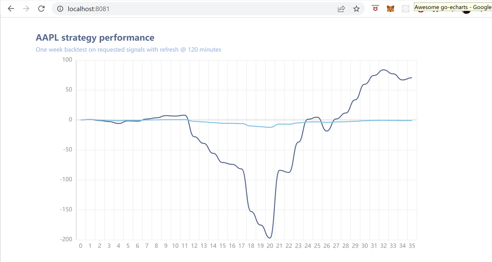

# simpleBacktester
### CS7319 Software Architecture & Design Final Project, using batch-sequential and client/server (REST API) via Golang Backend, Ruby on Rails Frontend.

Inspired by Trellis - service targeting retail traders and enabling the implementation of bot executed trading strategies with an intuitive user interface. www.trellistrade.co

This project, set out to explore the possibility of introducing a new product feature that allows users to view a 1 week backtest of their designed strategy before they execute the bot. As of now, only one benchmark (50 day MA) and one trading criterea (sell if higher/lower) is supported in this exploration. The only variable in this iteration of the project is refresh time. The trellis platform has a large number of custom fields and benchmarks for their bots and integrating each of these will take time.

## Run Instructions for Windows:
Add polygon API key in line 51 src/main.go
### Backend
Output @ localhost:8081
```
C:\> cd simpleBacktesterGo
C:\simpleBacktesterGo> cd src
C:\simpleBacktesterGo\src> go run .

```
### Frontend
Access @ localhost:3000
```
C:\> cd simpleBacktesterRuby
C:\simpleBacktesterRuby> rails server -p 3000

```


## Screenshots



limitations:
moving averages assume fixed difference (e.g. 50 day is really 75 day to accommodate for weekends & holidays, also the denominator may not represent actual days included)
Bot time execution is simulated and may not be the same timeframes in reality
Assumes 24/7 trading hours mon-fri
Assumes no transaction/exchange/trading fees
Indicator calculated at present time and applied to historicals, disregarding current indicator at historical moment
Therefor ^ backtest only provides results based on current indicator value
Can only do one buy & sell trigger
Unknown how bot derives and how often bot calculates indicators, and what bot operating hours are

frontend limitations:
It's all prefilled request links, not customizable form inputs to actually get specific user requests as it should be.